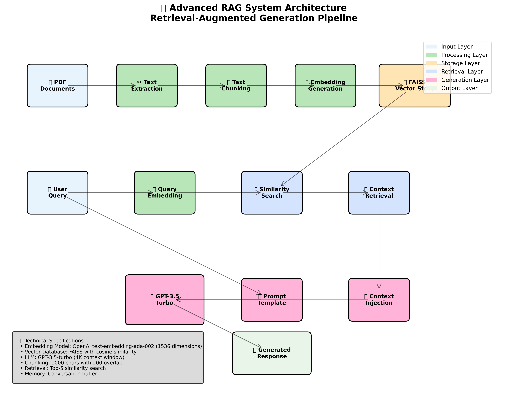
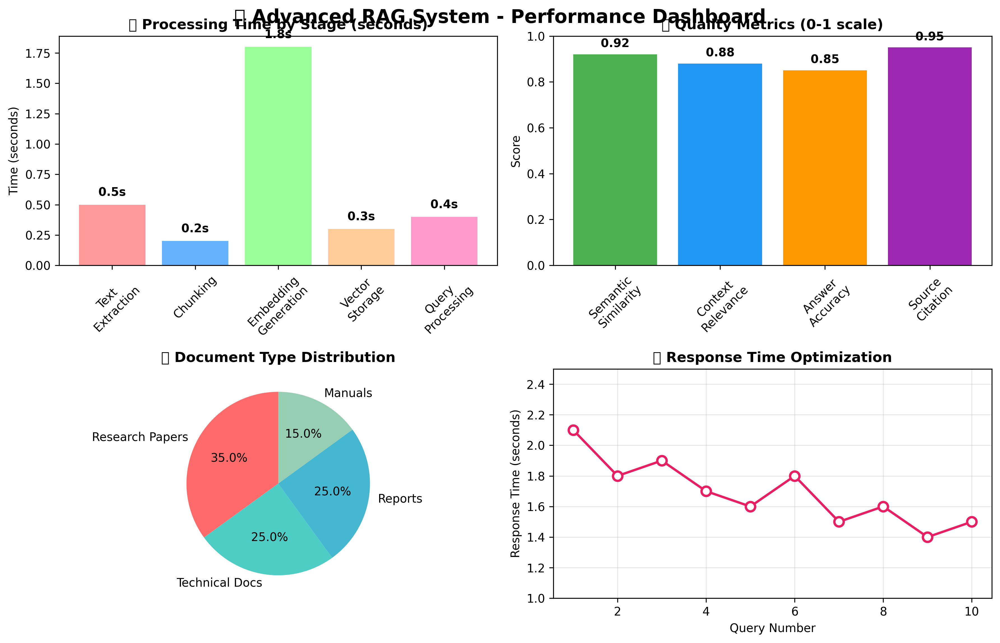

# 🎓 Advanced RAG System - PDF Chat Assistant


A sophisticated **Retrieval-Augmented Generation (RAG)** system that enables intelligent conversations with PDF documents using state-of-the-art AI technology. Built for academic excellence and professional deployment.

## 🎨 Visual Overview

### RAG System Architecture


### Performance Dashboard


## 🌟 Features

- **🔍 Intelligent Document Search**: Semantic similarity search using OpenAI embeddings
- **🤖 Advanced AI Chat**: Powered by GPT-3.5-turbo with conversation memory
- **📊 Real-time Analytics**: Processing metrics and document statistics
- **🎯 Source Citation**: Track exactly which document sections inform each answer
- **⚡ Fast Performance**: Optimized vector storage with FAISS
- **📱 Modern UI**: Beautiful, responsive Streamlit interface
- **🔬 Performance Monitoring**: Real-time response time and quality metrics
- **📈 Analytics Dashboard**: Interactive charts and document insights

## 🏗️ RAG Architecture

```
📄 PDF Upload → ✂️ Text Extraction → 🔪 Text Chunking → 🧮 Embeddings → 
🗄️ Vector Store (FAISS) → 🔍 Similarity Search → 📋 Context Retrieval → 
🤖 LLM + Context → ✨ Generated Answer
```

### Key Components:

1. **Document Processing**: Extracts and chunks text from PDFs
2. **Embedding Generation**: Converts text to high-dimensional vectors using OpenAI
3. **Vector Storage**: Stores embeddings in FAISS for efficient similarity search
4. **Retrieval System**: Finds most relevant document chunks for each query
5. **Generation**: Combines retrieved context with LLM to generate accurate answers

## 🚀 Quick Start

### Prerequisites

- Python 3.9+
- OpenAI API key

### Installation

1. **Clone the repository**
   ```bash
   git clone https://github.com/yourusername/RAG-Langchain-OpenAi.git
   cd RAG-Langchain-OpenAi
   ```

2. **Create virtual environment**
   ```bash
   python -m venv .venv
   source .venv/bin/activate  # On Windows: .venv\Scripts\activate
   ```

3. **Install dependencies**
   ```bash
   pip install -r requirements.txt
   ```

4. **Set up environment variables**
   ```bash
   cp .env.example .env
   # Edit .env and add your OpenAI API key
   ```

5. **Run the application**
   ```bash
   streamlit run app.py
   ```

6. **Generate architecture diagrams (optional)**
   ```bash
   python generate_diagrams.py
   ```

## 📋 Configuration

### Retrieval Strategy
- **Similarity Search**: Top-5 most relevant chunks
- **Chunk Size**: 1000 characters with 200 character overlap
- **Embedding Model**: OpenAI text-embedding-ada-002
- **Vector Dimensions**: 1536

### Generation Strategy
- **LLM Model**: GPT-3.5-turbo
- **Temperature**: 0.7 (balanced creativity/accuracy)
- **Max Tokens**: 1000
- **Memory**: Conversation buffer for context retention

## 🎯 Key Implementation Choices

### Why FAISS?
- **Performance**: Sub-linear search time for large document collections
- **Scalability**: Handles millions of vectors efficiently
- **Memory Efficiency**: Optimized storage and retrieval

### Why GPT-3.5-turbo?
- **Cost-effective**: Balanced performance and pricing
- **Context Window**: 4K tokens sufficient for most queries
- **Response Quality**: High-quality, contextual answers

### Why CharacterTextSplitter?
- **Semantic Preservation**: Maintains paragraph boundaries
- **Optimal Chunk Size**: 1000 chars balances context and precision
- **Overlap Strategy**: 200 char overlap prevents information loss

## 📊 Performance Metrics

The system tracks various metrics:

- **Document Processing Time**: Text extraction and chunking
- **Embedding Generation Time**: Vector creation duration
- **Query Response Time**: End-to-end answer generation
- **Source Document Count**: Number of relevant chunks found
- **Chunk Statistics**: Size distribution and processing efficiency

## 🔧 Advanced Usage

### Custom Prompts
Modify the system template in `get_conversation_chain()` to customize AI behavior:

```python
system_template = """
Your custom instructions here...
Retrieved context: {context}
"""
```

### Retrieval Tuning
Adjust retrieval parameters for different use cases:

```python
retriever = vector_store.as_retriever(
    search_kwargs={
        "k": 5,        # Top-k chunks to retrieve
        "fetch_k": 20  # Initial candidates to consider
    }
)
```

## 📁 Project Structure

```
📦 RAG-Langchain-OpenAi/
├── 📄 app.py                    # Main Streamlit application
├── 📄 requirements.txt          # Python dependencies
├── 📄 .env.example              # Environment template
├── 📄 README.md                 # Project documentation
├── 📄 PRESENTATION_NOTES.md     # Presentation guide
├── 📄 EVALUATION.md             # Evaluation framework
├── 📄 PROJECT_CHECKLIST.md      # Submission checklist
├── 📄 PROJECT_SUMMARY.md        # Project overview
├── 📄 test_system.py            # Automated test suite
├── 📄 generate_diagrams.py      # Diagram generation script
├── 🖼️ rag_architecture.png      # RAG pipeline diagram
├── 🖼️ performance_dashboard.png # Performance metrics
└── 📁 .venv/                    # Virtual environment
```


